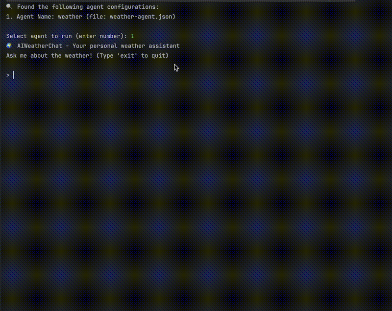

# 🌤️ CLI AI Agent - CLI Application

🚀 **CLI AI Agent** is a command-line application simulating an AI agent that processes structured weather-related queries. It demonstrates agent-tool interaction patterns without relying on real LLMs, making it ideal for educational, architectural, and prototyping purposes.

---

## 📌 Features

✅ **Modular Agent Architecture** – Agents can be defined via JSON configuration files.  
✅ **Dynamic Tool Registry** – Tools are dynamically loaded and injected into agents via a registry.  
✅ **Structured Query Handling** – Each agent handles specific request patterns.  
✅ **Synthetic Execution** – Tools return simulated responses for defined request structures.  
✅ **CLI Chat Interface** – Simple interactive session between user and agent.  
✅ **Extensible JSON-Based Configuration** – Add new agents/tools by editing config files.

---

## 📂 Project Structure
```
📦 cli-ai-agent
├── configs/            # JSON configurations for agents 
│ └── weather_agent.json 
├── 📂 src/
│ ├── main/kotlin/
│ │ ├── agent/          # Agent logic
│ │ ├── chat/           # CLI session logic
│ │ ├── config/         # Agent config classes 
│ │ ├── factory/        # Factories for agents/tools
│ │ ├── loader/         # JSON config loader
│ │ ├── tool/           # Tool interfaces and implementations
│ │ └── Main.kt         # Main entry point
├── README.md           # This documentation
```

---

## 🛠️ Setup & Running

### 🔴 Prerequisites

Ensure you have the following installed:
- **Java 17+**
- **Kotlin**
- **Gradle**
- **Git**

---

### 🚀 Run the App

1️⃣ Clone the repository:
```bash
git clone https://github.com/rbbozkurt/cli-ai-agent.git
cd cli-ai-agent
```

2️⃣ Ensure the `configs/` folder exists and contains at least one valid JSON config (e.g., `weather-agent.json`).

3️⃣ Build the project:
```bash
./gradlew build
```
4️⃣ Run the app:
```bash
./gradlew run
```
5️⃣ Select an agent by number when prompted and start chatting:

```
🔍 Found the following agent configurations:
1. Agent Name: weather (file: weather-agent.json)

Select agent to run (enter number): 1
🌍 AIWeatherChat - Your personal weather assistant
Ask me about the weather! (Type 'exit' to quit)

> Determine the temperature in London in 2 hours
It will be 34°C in London in 2 hours.

> Determine the temperature in London.
I can only process requests like: 'Determine the temperature in <city> in <time>'.
```

---

## 🎬 Demo
### 💬 AI Weather Agent Interaction


---
## 🧠 Agent Design
Agents are driven by configuration and tool registry:

### Sample `configs/weather-agent.json`
```json
{
    "agentName": "weather",
    "toolRegistry": {
        "tools": ["weather"]
    }
}
```

### Supported Query Format
```php
Determine the temperature in <city> in <duration>
```
Only valid formats are processed.

#### Example: 

✅ Determine the temperature in London in an hour

❌ What's the weather in Berlin?

---

## 🧱 Extending the System

- Add new agents by implementing `Agent` interface and updating `AgentFactory`.

- Add new tools by implementing `Tool` interface and registering them in `ToolRegistryFactory`.

- Configure agents by adding new `.json` files to the `configs/` directory.


---

## 📧 Contact

👤 **R. Berkay Bozkurt**  
📧 Email: resitberkaybozkurt@gmail.com  
📂 GitHub: [github.com/rbbozkurt](https://github.com/rbbozkurt)